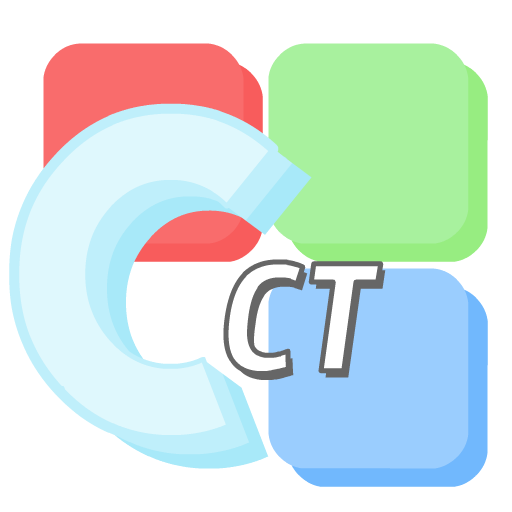
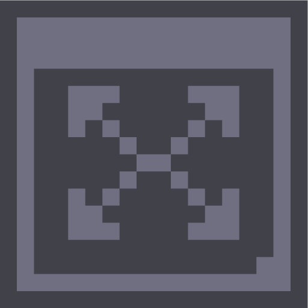
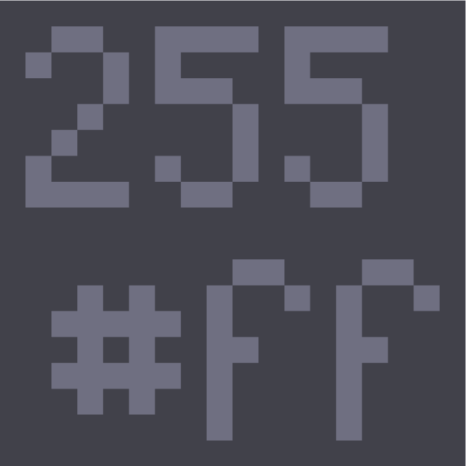
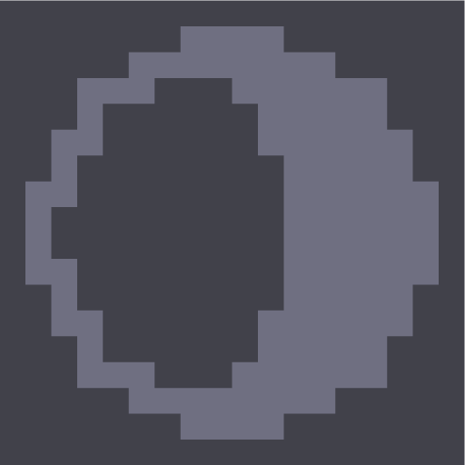
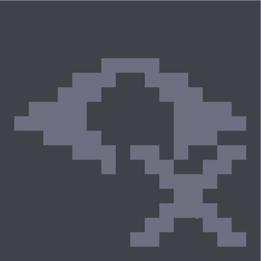
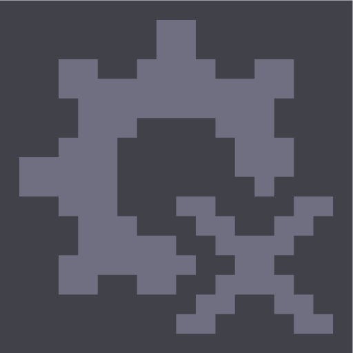

## Clarity CT - RGB Colour Tool 🎨

An RGB Colour Picker Tool written in C++ using raylib.  
Held together by duct tape and half a dream.

### 📖 Contents
+ [About](#about)
+ [Features](#features)
+ [Prerequisites](#prerequisites)
+ [Build from source](#build)
+ [Using Clarity CT](#usage)
+ [Answers to questions nobody aksed](#faq)

### 🔍 About <a name = "about"></a>
Clarity CT is a simple, customisable RGB colour picker and palette tool intended to be used alongside graphic design applications.  
Its whole purpose is to provide you with an easily copyable colour value in either RGB or HEX notation.  
It started as a small, fun foray into raylib and turned into the poorly written spaghetti behemoth it is now.

>`"Oh. That's gross. That is, in fact, heinous."`  
>*-Someone I showed the code to*

It is not a well written program, and it is not meant to be. This is quite literally just a pet project cobbled together by a hobbyist that grew way beyond the scope it was supposed to have. If you want to have a peek under the hood, then that's on you.


### 🎨 Features <a name = "features"></a>
- **Interactive Colour Picker:** - Select a specific hue using the colour dial and narrow down its shade or tint.
- **Display related colours:** - Automatically generate complement and triadic colours, alongside shades and tints thereof.
- **Copyable HEX and RGB values:** - Easily copy colour values for use in other applications with a single click.
- **Custom UI:** - Scale, move or hide elements to create a comfortable layout in an optional Dark Mode.

### ✅ Prerequisites <a name = "prerequisites"></a>
- **raylib** (www.raylib.com)

### 🛠️ Building from source <a name = "build"></a>
Compilation is currently only tested with C++20 on GCC 13.3 and raylib v5.6
#### Using Make:
Clone the repository and compile using Make
```sh
git clone https://github.com/Randoodl/Clarity_CT.git
cd Clarity_CT
make
```

### ⌨️ Using Clarity CT <a name = "usage"></a>
Clarity CT is designed to be intuitive and lazily operable with single clicks. Practically every generated colour you can see on-screen is selectable.  

Clicking the `Current Colour` element will copy the colour's RGB or HEX value to your clipboard, depending on your toggled notation mode.  

The `Toolbar` allows you to change the way Clarity CT presents itself, giving you the ability to create a layout that is comfortable to use.

| Icon                                                                      | Action                                                                      |
| :------------------------------------------------------------------------ | :-------------------------------------------------------------------------- |
|      | Show the frames to scale, move or hide elements.                            |
|  | Switch between RGB and HEX notation.                                        |
|  | Toggle dark mode.                                                           |
|    | Toggle showing hidden elements (they remain non-interactive while hidden).  |
|      | Save current configuration (layout, notation mode, dark mode toggle).       |
|     | Reset configuration to default settings (does not overwrite config file).   |

> [!TIP]  
> A Frame with its content hidden can be dragged off-screen to declutter the UI.  
> It's not an elegant way of doing it, but it works and I have put too much time into this joke-taken-too-seriously project as is.

> [!NOTE]  
> The configuration is saved in a daringly named Clarity.conf alongside the binary.

### ❓ Answers to questions nobody asked <a name = "faq"></a>
* `Why?`  
    * Because, while messing around with RGB channels in python, I came up with what has got to be [the worst way to whip up 1530 different RGB hue tuples](./src/ColourDial.cpp#L144).  
    I decided to try and do the same in C++, but while I was at it I figured I might as well add some extra nonsense, you know, for a laugh.  
    Somewhere along the way it went from 'a laugh' to an actual program (*though this statement is still up for debate*).

* `Was AI used in this?`
    * My guy, I invite you to look at the [source code](./src/ToolContainer.cpp#L282). There isn't a model lobotomised enough to come up with the ramshackle, cobbled together fustercluck that is Clarity CT. All of this code is a nightmarish fever dream cooked up by yours truly. 100% idiot coded for the love of the game.

* `No HSL?`  
    * Nope.  
    This project grew way beyond the joke it was supposed to be. RGB and HEX is all you get.

* `I think the icons are terrible, can I change those?`
    * First off, ouch.  
    But secondly: yes you can! (Though only during compilation.)  
    The icons are stored as dumb strings in the daringly named [IconStrings.h](./include/IconString.h).  
    You don't even have to confine yourself to the 16x16 grid: anything goes as long as you make it square.
    There's a [quick and dirty python script](./tools/Icons.py) to turn simple transparent .pngs into icons strings, if you fancy.

* `I don't like the look of that EmbeddedFont.h`
    * That's not a question, but also: good!  
    You probably shouldn't be trusting a [huge pile of hexadecimals](./include/EmbeddedFont.h) provided by a stranger on the internet, anyway. If you'd rather compile your own font there's a handy-dandy [raylib font exporter](./tools/RaylibConvertFont.cpp) tidbit so you can make your own EmbeddedFont.h at your leisure.

* `Can I use thi-`
    * Yes.  
    If you somehow managed to find an actual use case  for any of this you are free to use any or all parts of Clarity CT for any purpose.  
    I'd appreciate a nod if you did, though.

* `Clarity CT?`
    * The *C* in 'CT' stands for 'fun'
